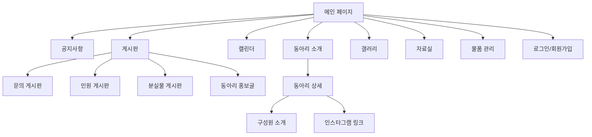

# KENTECH 동아리연합회 '화란' 웹사이트 구축 계획

## 1. 기술 스택

- **프레임워크**: Next.js 14+ (App Router)
- **스타일링**: Tailwind CSS + shadcn/ui 컴포넌트
- **상태관리**: React Context (인증) + SWR (데이터 fetching)
- **백엔드/DB**: Notion API (`@notionhq/client`)
- **인증**: 자체 회원가입/로그인 (bcrypt 암호화, JWT 세션) -> Notion DB 저장
- **배포**: AWS (Amplify 또는 EC2) + 커스텀 도메인
- **기타**: `react-calendar` (캘린더), `next/image` (이미지 최적화)

## 2. 디자인 시스템 (로고 기반 색상)

로고 분석 결과 다음 팔레트를 적용합니다:

- **Primary**: `#E05252` (코랄 레드 - 로고 메인 컬러)
- **Primary Light**: `#F4A0A0` (연분홍 - 로고 꽃잎 하이라이트)
- **Primary Dark**: `#C43A3A` (진한 레드 - 호버/액센트)
- **Background**: `#FAFAFA` (밝은 배경, 가독성 우선)
- **Surface**: `#FFFFFF` (카드/컨테이너)
- **Dark**: `#1A1A1A` (텍스트, 헤더/푸터 배경)
- **Gray**: `#6B7280` (보조 텍스트)

참고 사이트(HUFS, 중앙대)처럼 **밝은 배경 + 포인트 컬러** 조합으로 깔끔한 느낌을 유지합니다.

## 3. 사이트 구조 (전체 페이지맵)




## 4. 페이지별 상세 기능

### 4-1. 메인 페이지 (`/`)

- 상단 랜덤 동아리 배너 (자동 슬라이드)
- 중요 공지사항 카드 (최신 3~5개)
- 동아리연합회 소개 섹션
- 외부 채널 링크 영역 (동연 인스타, 공연 인스타 등 정보 표시)
- 다가오는 일정 미리보기
- 푸터: 연락처, 위치, SNS 링크

### 4-2. 공지사항 (`/notices`)

- 공지 목록 (페이지네이션)
- 중요 공지 상단 고정 (핀)
- 공지 상세 보기 (`/notices/[id]`)
- 관리자: 공지 작성/수정/삭제

### 4-3. 동아리 소개 (`/clubs`)

- 동아리 카드 그리드 (로고, 이름, 한줄 소개)
- 동아리 상세 (`/clubs/[id]`): 소개, 활동 사진, 구성원, 인스타그램 링크
- 동아리장 및 구성원 프로필 카드

### 4-4. 캘린더 (`/calendar`)

- 월간 캘린더 뷰
- 동아리별 색상 구분 일정 표시
- 일정 상세 모달
- 동아리장: 자기 동아리 일정 등록/수정

### 4-5. 게시판 (`/boards/*`)

- **문의 게시판** (`/boards/qna`): 일반 Q&A, 답변 기능
- **민원 게시판** (`/boards/complaints`): 건의/민원, 익명 옵션
- **분실물 게시판** (`/boards/lost-found`): 사진 첨부, 해결 상태 표시
- **동아리 홍보글** (`/boards/promotions`): 동아리장이 직접 작성/수정

### 4-6. 갤러리 (`/gallery`)

- 행사별 앨범 그리드
- 라이트박스 이미지 뷰어
- 행사 기록 (날짜, 설명)

### 4-7. 자료실 (`/documents`)

- 회칙, 양식, 회의록 등 문서 분류
- 파일 다운로드 링크 (Notion 또는 외부 저장소)

### 4-8. 물품 관리 (`/inventory`)

- 물품 목록 (이름, 수량, 상태, 보관 위치)
- 대여/반납 기록

### 4-9. 인증 (`/auth/`*)

- 로그인 (`/auth/login`)
- 회원가입 (`/auth/register`)
- (추후) 역할 기반 권한 분리

## 5. Notion 데이터베이스 설계 (13개 DB)


| DB 이름 | 주요 속성 |
| ----- | ----- |


- **회원(Members)**: 이름, 이메일, 비밀번호(해시), 동아리, 역할, 가입일
- **공지사항(Notices)**: 제목, 내용, 작성자, 작성일, 중요여부, 첨부파일
- **동아리(Clubs)**: 이름, 소개, 로고, 인스타그램URL, 배너이미지, 분류
- **동아리구성원(ClubMembers)**: 이름, 역할(장/부장/회원), 소개, 프로필사진, 동아리(Relation)
- **일정(Events)**: 제목, 시작일, 종료일, 동아리(Relation), 장소, 설명
- **문의게시판(QnA)**: 제목, 내용, 작성자, 작성일, 답변, 답변일
- **민원게시판(Complaints)**: 제목, 내용, 작성자, 작성일, 상태, 익명여부
- **분실물(LostFound)**: 제목, 설명, 이미지, 장소, 상태(분실/발견), 작성일
- **홍보글(Promotions)**: 제목, 내용, 동아리(Relation), 작성자, 작성일, 이미지
- **갤러리(Gallery)**: 행사명, 날짜, 설명, 이미지들, 동아리(Relation)
- **자료(Documents)**: 제목, 분류(회칙/양식/회의록), 파일, 작성일
- **물품(Inventory)**: 이름, 수량, 상태, 보관위치, 비고
- **배너(Banners)**: 동아리(Relation), 이미지, 링크, 활성여부

## 6. 프로젝트 디렉토리 구조

```
hwaran/
  app/
    layout.tsx              # 루트 레이아웃 (헤더, 푸터)
    page.tsx                # 메인 페이지
    notices/
      page.tsx              # 공지 목록
      [id]/page.tsx         # 공지 상세
    clubs/
      page.tsx              # 동아리 목록
      [id]/page.tsx         # 동아리 상세
    calendar/
      page.tsx              # 캘린더
    boards/
      qna/page.tsx          # 문의 게시판
      complaints/page.tsx   # 민원 게시판
      lost-found/page.tsx   # 분실물 게시판
      promotions/page.tsx   # 홍보글
    gallery/
      page.tsx              # 갤러리
    documents/
      page.tsx              # 자료실
    inventory/
      page.tsx              # 물품 관리
    auth/
      login/page.tsx        # 로그인
      register/page.tsx     # 회원가입
    api/                    # API Routes (Notion 연동)
      notices/route.ts
      clubs/route.ts
      events/route.ts
      boards/route.ts
      auth/route.ts
      ...
  components/
    layout/
      Header.tsx
      Footer.tsx
      Sidebar.tsx
      MobileNav.tsx
    ui/                     # shadcn/ui 컴포넌트
    home/
      HeroBanner.tsx        # 랜덤 동아리 배너
      NoticePreview.tsx     # 중요 공지 카드
      UpcomingEvents.tsx    # 다가오는 일정
      ExternalLinks.tsx     # 외부 채널 정보
    notices/
    clubs/
    calendar/
    boards/
    gallery/
    auth/
  lib/
    notion.ts               # Notion 클라이언트 설정
    auth.ts                  # 인증 유틸리티
    constants.ts             # DB ID, 상수
    types.ts                 # TypeScript 타입 정의
    mock-data.ts             # Phase 1용 목업 데이터
  public/
    logo.png                 # 화란 로고
    images/
```

## 7. 구현 순서 (Phase 분리)

### Phase 1: 프로젝트 초기화 + 디자인 시스템 (1단계)

- Next.js 프로젝트 생성 + Tailwind + shadcn/ui 설정
- 색상 팔레트, 폰트, 공통 컴포넌트 정의
- 헤더/푸터/네비게이션 레이아웃 구현
- 반응형 모바일 메뉴

### Phase 2: 프론트엔드 페이지 구현 - 목업 데이터 (2~4단계)

- 목업 데이터(`mock-data.ts`)로 모든 페이지 UI 완성
- 메인 페이지 (배너, 공지 미리보기, 일정, 외부 링크)
- 공지사항 (목록 + 상세)
- 동아리 소개 (목록 + 상세 + 구성원)
- 캘린더
- 게시판 4종 (문의, 민원, 분실물, 홍보)
- 갤러리
- 자료실
- 물품 관리
- 로그인/회원가입 UI

### Phase 3: Notion 데이터베이스 설계 + API 연동 (5~6단계)

- Notion Integration 생성 및 API 키 발급
- 13개 데이터베이스 생성
- Next.js API Routes 구현 (CRUD)
- 목업 데이터를 Notion API 호출로 교체

### Phase 4: 인증 시스템 + 권한 (7단계)

- 회원가입/로그인 API (bcrypt + JWT)
- 세션 관리 미들웨어
- (추후) 역할 기반 접근 제어

### Phase 5: 배포 (8단계)

- AWS 환경 구성
- 도메인 연결
- 환경변수 설정
- CI/CD 파이프라인

## 8. 참고 사이트 반영 사항

**HUFS 동아리연합회** 스타일 참고:

- 회장단 인사말 및 조직 소개 섹션 구성
- 분과별 동아리 분류
- 연락처 및 위치 정보 푸터

**중앙대 동아리연합회** 스타일 참고:

- 카드형 공지사항 + 자료실 + 시설/물품 레이아웃
- Q&A 및 온라인 신청 시스템 구조
- 최신 공지사항 사이드바
- 깔끔한 홈 대시보드 구성

