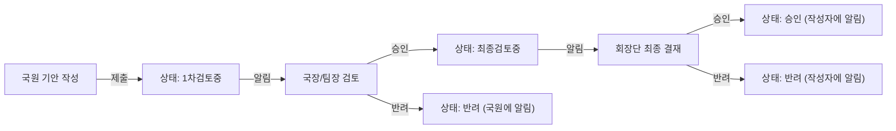

# 관리자 포털 구축 계획

## 1. 권한 체계 재설계

현재 `User.role`(`"관리자" | "동아리장" | "부동아리장" | "회원"`)을 확장합니다.

`**src/lib/types.ts` 변경**

```typescript
// 기존 role에 관리자 3단계 추가
type UserRole = "회장단" | "국장팀장" | "국원" | "동아리장" | "부동아리장" | "회원";

// 권한 레벨 헬퍼
const ADMIN_ROLES = ["회장단", "국장팀장", "국원"] as const;
// 회장단(3) > 국장팀장(2) > 국원(1)
```

**새 타입 추가**

```typescript
interface Draft { /* 기안 */ }
interface DraftComment { /* 결재 코멘트 */ }
interface ClubApplication { /* 동아리 제출 서류 */ }
interface Notification { /* 알림 */ }
```

---

## 2. 새 Notion DB (3개 추가)


| DB                     | 주요 속성                                                                                     |
| ---------------------- | ----------------------------------------------------------------------------------------- |
| 기안(Drafts)             | 제목, 내용, 유형(예산/동아리등록/물품사용/기타), 상태(임시저장/1차검토중/최종검토중/승인/반려), 작성자ID, 작성자명, 현재결재자ID, 첨부파일, 작성일 |
| 서류신청(ClubApplications) | 제목, 유형, 동아리명, 제출자, 제출일, 상태, 첨부파일, 검토의견                                                    |
| 알림(Notifications)      | 수신자ID, 제목, 내용, 링크, 읽음여부, 생성일, 유형                                                          |


`scripts/setup-notion-dbs.ts` 및 `.env.local`에 3개 DB ID 추가.

---

## 3. 기안 순차 결재 워크플로우




- 국장/팀장도 기안 작성 가능 → 1차검토 없이 바로 최종검토중으로
- 임시저장 상태에서는 언제든 수정 가능

---

## 4. 라우트 및 미들웨어 구조

`**middleware.ts` (프로젝트 루트 신규)**

```typescript
// /admin/* 접근 시 JWT 쿠키 검증 + adminRole 확인
// 권한 미달 시 / 로 리다이렉트
```

**새 페이지 구조**

```
src/app/admin/
  layout.tsx             관리자 레이아웃 (사이드바 + 권한 가드)
  page.tsx               대시보드 (처리 대기 요약)
  applications/
    page.tsx             동아리 제출 서류 목록
    [id]/page.tsx        서류 상세 + 승인/반려
  drafts/
    page.tsx             기안 목록
    new/page.tsx         기안 작성 (파일 업로드 포함)
    [id]/page.tsx        기안 상세 + 결재 타임라인
  notices/
    new/page.tsx         공지 작성 (회장단/국장팀장만)
  notifications/
    page.tsx             알림 전체 목록
```

**새 API Routes**

```
src/app/api/admin/
  drafts/route.ts        GET(목록), POST(신규기안)
  drafts/[id]/route.ts   GET(상세), PATCH(결재액션)
  applications/route.ts  GET(목록)
  applications/[id]/route.ts  PATCH(승인/반려)
  notifications/route.ts GET(내 알림), PATCH(읽음처리)
  upload/route.ts        POST(파일 → AWS S3 업로드, URL 반환)
```

---

## 5. 파일 업로드

- **AWS S3** 버킷 활용 (기존 AWS 배포 환경에 맞춤)
- `/api/admin/upload` → `@aws-sdk/client-s3` presigned URL 방식
- 반환된 S3 URL을 Notion DB `첨부파일` 속성에 저장
- 추가 패키지: `@aws-sdk/client-s3`, `@aws-sdk/s3-request-presigner`

---

## 6. 알림 시스템

**사이트 내 알림**

- 헤더 `NotificationBell.tsx` 컴포넌트 추가
- 로그인 상태일 때 5초 폴링으로 미읽음 수 표시
- Notion `알림` DB에 레코드 생성

**이메일 알림**

- `nodemailer` + SMTP (또는 `Resend` API)
- 알림 생성 API에서 동시에 이메일 발송
- 추가 패키지: `nodemailer`, `@types/nodemailer`
- 추가 `.env.local` 키: `SMTP_HOST`, `SMTP_PORT`, `SMTP_USER`, `SMTP_PASS`

---

## 7. 관리자 대시보드 (`/admin`)

- 처리 대기 기안 수 (내가 결재해야 하는 것)
- 처리 대기 서류신청 수
- 최근 제출된 기안 목록 (카드)
- 최근 서류신청 목록 (카드)
- 미읽음 알림 목록
- 역할별 접근 가능 액션 버튼

---

## 8. 새 컴포넌트

```
src/components/admin/
  AdminSidebar.tsx        사이드바 (역할별 메뉴 분기)
  ApprovalTimeline.tsx    결재 단계 시각화
  DraftForm.tsx           기안 작성 폼 (파일 업로드 포함)
  StatusBadge.tsx         상태 배지 (임시저장/검토중/승인/반려)
  NotificationBell.tsx    헤더 알림 벨 (Header.tsx에 삽입)
```

---

## 9. AuthContext (세션 관리)

현재 로그인 상태가 클라이언트에 유지되지 않음. `context/AuthContext.tsx` 추가:

- 로그인 시 JWT를 `httpOnly` 쿠키로 저장
- `useAuth()` 훅으로 어디서든 현재 사용자 정보·역할 접근
- `middleware.ts`에서 서버사이드 보호

---

## 10. 구현 순서

1. `types.ts` 확장 + `constants.ts` 어드민 역할 상수 추가
2. `AuthContext` + 쿠키 기반 세션 + `middleware.ts`
3. Notion DB 3개 추가 + `.env.local` 업데이트
4. 관리자 레이아웃 + 사이드바 (`/admin/layout.tsx`)
5. API Routes: drafts, applications, notifications, upload
6. 기안 작성/목록/상세 페이지 (파일 업로드 포함)
7. 서류신청 목록/상세/승인반려 페이지
8. 관리자 대시보드 (`/admin`)
9. 알림 시스템 (NotificationBell + 이메일)
10. 공지 작성 페이지 (기존 notices API 재활용)

