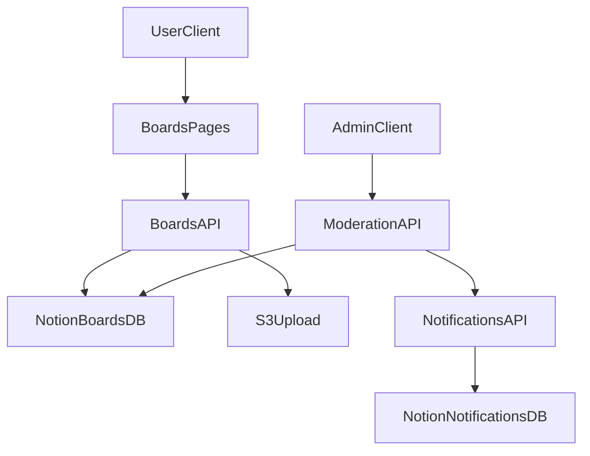

# 커뮤니티/관리자/Notion 확장 구현 계획

## 목표

- `커뮤니티` 상단 메뉴 클릭 시 404를 제거하고, 커뮤니티 허브 페이지를 제공
- 관리자 사이드바에서 `기안 작성` 선택 시 `기안 목록` 하이라이트가 겹치는 버그 수정
- Notion 연동을 기반으로 `문의/민원/분실물/홍보글` 전체 게시판에 대해 작성·수정·삭제·댓글·첨부·상태관리·승인 플로우까지 확장

## 현재 원인 요약

- 커뮤니티 404: [src/lib/constants.ts](c:/Users/ja010/Desktop/hwaran/src/lib/constants.ts) 에서 `커뮤니티` 링크가 `/boards`인데, 실제 라우트 파일 [src/app/boards/page.tsx](c:/Users/ja010/Desktop/hwaran/src/app/boards/page.tsx) 가 없음
- 사이드바 하이라이트 버그: [src/components/admin/AdminSidebar.tsx](c:/Users/ja010/Desktop/hwaran/src/components/admin/AdminSidebar.tsx) 의 활성화 조건이 `pathname.startsWith(item.href)`라서 `/admin/drafts/new`에서 `/admin/drafts`도 동시에 활성
- 커뮤니티 페이지는 현재 mock 데이터 의존: 예) [src/app/boards/qna/page.tsx](c:/Users/ja010/Desktop/hwaran/src/app/boards/qna/page.tsx), [src/app/boards/complaints/page.tsx](c:/Users/ja010/Desktop/hwaran/src/app/boards/complaints/page.tsx)
- API는 이미 GET/POST 뼈대 보유: [src/app/api/boards/route.ts](c:/Users/ja010/Desktop/hwaran/src/app/api/boards/route.ts)

## 구현 범위(확정)

- 우선순위: 확장(P3)
- 대상 게시판: 전체(문의/민원/분실물/홍보글)

## 실행 계획

1. 라우팅/내비게이션 버그 수정

- [src/app/boards/page.tsx](c:/Users/ja010/Desktop/hwaran/src/app/boards/page.tsx) 신규 생성
  - 4개 게시판 진입 카드(문의/민원/분실물/홍보글)
  - 각 게시판 최신 글 요약(서버 fetch) 또는 최소 링크 허브 형태
- [src/components/admin/AdminSidebar.tsx](c:/Users/ja010/Desktop/hwaran/src/components/admin/AdminSidebar.tsx) 활성화 로직 수정
  - 정밀 매칭: `대시보드`는 exact, `기안 작성`은 exact, `기안 목록`은 `/admin/drafts` exact 또는 `/admin/drafts/[id]`만 활성

1. 커뮤니티 데이터 계층 정비(Notion 기준)

- [src/lib/types.ts](c:/Users/ja010/Desktop/hwaran/src/lib/types.ts)
  - `BoardPost` 확장: `updatedAt`, `attachments`, `comments`, `authorId`, `visibility`, `approvalStatus`
  - `BoardComment` 타입 추가
- [src/lib/notion.ts](c:/Users/ja010/Desktop/hwaran/src/lib/notion.ts)
  - 필요 시 comments DB ID 및 헬퍼(관계형/파일/작성자 등) 확장

1. API 확장 (CRUD + 댓글 + 승인)

- [src/app/api/boards/route.ts](c:/Users/ja010/Desktop/hwaran/src/app/api/boards/route.ts)
  - GET: 카테고리/검색/페이지네이션/상태 필터
  - POST: 작성자 검증, 카테고리별 필수필드 검증, 첨부 저장
- [src/app/api/boards/[id]/route.ts](c:/Users/ja010/Desktop/hwaran/src/app/api/boards/[id]/route.ts) 신규
  - GET 상세, PATCH 수정, DELETE 삭제(작성자/관리자 권한)
- [src/app/api/boards/[id]/comments/route.ts](c:/Users/ja010/Desktop/hwaran/src/app/api/boards/[id]/comments/route.ts) 신규
  - 댓글 생성/조회, 관리자 답변
- [src/app/api/admin/boards/[id]/moderation/route.ts](c:/Users/ja010/Desktop/hwaran/src/app/api/admin/boards/[id]/moderation/route.ts) 신규
  - 승인/반려/상태 변경(민원 해결 처리, 분실물 해결 처리 등)

1. 첨부파일/권한 연동

- 기존 [src/app/api/admin/upload/route.ts](c:/Users/ja010/Desktop/hwaran/src/app/api/admin/upload/route.ts) 재사용 범위 확장 또는 `/api/boards/upload` 분리
- 작성자 본인 수정/삭제 + 관리자 오버라이드 정책을 [src/context/AuthContext.tsx](c:/Users/ja010/Desktop/hwaran/src/context/AuthContext.tsx) 사용자 정보 기반으로 적용

1. 게시판 UI 전면 개선(전체 4종)

- 기존 목록 페이지([src/app/boards/qna/page.tsx](c:/Users/ja010/Desktop/hwaran/src/app/boards/qna/page.tsx) 등 4개)에서 mock 직접 참조 제거
- 공통 컴포넌트 신규
  - [src/components/boards/BoardList.tsx](c:/Users/ja010/Desktop/hwaran/src/components/boards/BoardList.tsx)
  - [src/components/boards/BoardEditor.tsx](c:/Users/ja010/Desktop/hwaran/src/components/boards/BoardEditor.tsx)
  - [src/components/boards/BoardDetail.tsx](c:/Users/ja010/Desktop/hwaran/src/components/boards/BoardDetail.tsx)
  - [src/components/boards/CommentThread.tsx](c:/Users/ja010/Desktop/hwaran/src/components/boards/CommentThread.tsx)
- 신규 라우트
  - [src/app/boards/[category]/new/page.tsx](c:/Users/ja010/Desktop/hwaran/src/app/boards/[category]/new/page.tsx)
  - [src/app/boards/[category]/[id]/page.tsx](c:/Users/ja010/Desktop/hwaran/src/app/boards/[category]/[id]/page.tsx)
  - [src/app/boards/[category]/[id]/edit/page.tsx](c:/Users/ja010/Desktop/hwaran/src/app/boards/[category]/[id]/edit/page.tsx)

1. 관리자 모더레이션 화면 확장

- [src/app/admin](c:/Users/ja010/Desktop/hwaran/src/app/admin) 하위에 `커뮤니티 관리` 화면 추가
- 신고/반려/승인/숨김 처리와 처리 로그 확인
- 알림 연동: [src/app/api/admin/notifications/route.ts](c:/Users/ja010/Desktop/hwaran/src/app/api/admin/notifications/route.ts) 재사용

1. 테스트/검증

- 역할별(회원/국원/국장팀장/관리자) 권한 시나리오 테스트
- Notion 연결 시/미연결 시 fallback 테스트
- 게시글 생성→댓글→승인→수정/삭제 전 흐름 회귀 검증

## 데이터/흐름 개요

## 산출물

- 1차: 버그 2건 즉시 해결 (`/boards` 라우트 + 사이드바 active 수정)
- 2차: 게시판 API/페이지를 mock 의존에서 Notion 실데이터 기반 CRUD/댓글/첨부/승인 플로우로 통합
- 3차: 관리자 모더레이션 + 알림 연계까지 완성

