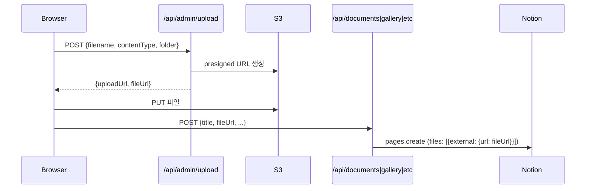

# 콘텐츠 관리자 기능 구현 계획

## 현재 구현 상태 (이미 완료)

- 기안 상신·결재 워크플로우 (`/admin/drafts/`)
- S3 파일 업로드 → Notion 첨부 저장 (`/api/admin/upload`)
- AuthContext, middleware, api-auth guard
- Admin 대시보드·레이아웃·사이드바

## 필요한 작업

### 1. Notion DB 및 환경변수 (선행 필수)

Notion 워크스페이스에 **조직도 DB** 1개 신규 생성.

- 속성: 이름(title), 직책(select), 부서(select), 팀(select), 순서(number)
- `.env.local`에 `NOTION_ORGCHART_DB=<ID>` 추가

기존 3개 DB(`NOTION_DRAFTS_DB`, `NOTION_APPLICATIONS_DB`, `NOTION_NOTIFICATIONS_DB`)도 아직 미생성이면 동시에 생성.

### 2. 업로드 라우트 확장

[`src/app/api/admin/upload/route.ts`](src/app/api/admin/upload/route.ts) — `folder` 파라미터 추가

```typescript
// 현재: key = `drafts/${Date.now()}-${filename}`
// 변경: const folder = body.folder ?? "drafts";
//        key = `${folder}/${Date.now()}-${filename}`
```

### 3. API CRUD 라우트 추가 (6개 도메인)

| 파일 (신규 또는 수정) | 추가할 메서드 | 권한 |
|---|---|---|
| `src/app/api/documents/route.ts` | `POST` | adminLevel ≥ 1 |
| `src/app/api/documents/[id]/route.ts` (신규) | `PATCH`, `DELETE` | adminLevel ≥ 1 |
| `src/app/api/inventory/route.ts` | `POST` | adminLevel ≥ 1 |
| `src/app/api/inventory/[id]/route.ts` (신규) | `PATCH`, `DELETE` | adminLevel ≥ 1 |
| `src/app/api/events/[id]/route.ts` (신규) | `PATCH`, `DELETE` | adminLevel ≥ 1 |
| `src/app/api/gallery/route.ts` | `POST` | adminLevel ≥ 1 |
| `src/app/api/gallery/[id]/route.ts` (신규) | `DELETE` | adminLevel ≥ 1 |
| `src/app/api/clubs/route.ts` | `POST` | adminLevel ≥ 2 |
| `src/app/api/clubs/[id]/route.ts` (신규) | `PATCH`, `DELETE` | adminLevel ≥ 2 |
| `src/app/api/orgchart/route.ts` (신규) | `GET`, `POST` | GET:공개, POST:adminLevel≥2 |
| `src/app/api/orgchart/[id]/route.ts` (신규) | `PATCH`, `DELETE` | adminLevel ≥ 2 |

모든 라우트는 기존 `guard()` 패턴 사용, mock 분기 포함.

### 4. `src/lib/data.ts` 함수 추가

기존 `get*` 패턴 그대로 아래 함수 추가:

- `createDocument`, `deleteDocument`
- `createInventoryItem`, `updateInventoryItem`, `deleteInventoryItem`
- `updateEvent`, `deleteEvent`
- `createGalleryAlbum`, `deleteGalleryAlbum`
- `createClub`, `updateClub`, `deleteClub`
- `getOrgChartMembers`, `createOrgChartMember`, `updateOrgChartMember`, `deleteOrgChartMember`

`src/lib/notion.ts`에 `orgchart: process.env.NOTION_ORGCHART_DB || ""` 추가.

### 5. 관리자 콘텐츠 관리 페이지 (6개 신규)

```
src/app/admin/content/
  documents/page.tsx    자료실 목록 + 파일 업로드 폼 (회칙/양식/회의록/기타)
  inventory/page.tsx    물품 목록 + 추가/수정/상태변경/삭제
  events/page.tsx       캘린더 이벤트 목록 + 추가/수정/삭제
  gallery/page.tsx      갤러리 앨범 목록 + 이미지 업로드
  clubs/page.tsx        동아리 목록 + 추가/수정/삭제
  orgchart/page.tsx     조직도 구성원 목록 + 추가/수정/삭제
```

각 페이지는 서버 컴포넌트에서 데이터 fetch 후 클라이언트 인터랙션은 인라인 `"use client"` 섹션 또는 별도 클라이언트 컴포넌트로 분리.

### 6. `OrgChart.tsx` 데이터 연동

현재 하드코딩 → Notion DB(`getOrgChartMembers`)로 교체. mock fallback은 기존 하드코딩 데이터 유지.

### 7. `AdminSidebar.tsx` 업데이트

"콘텐츠 관리" 섹션 추가:
- 자료실 관리 → `/admin/content/documents`
- 물품 관리 → `/admin/content/inventory`
- 캘린더 관리 → `/admin/content/events`
- 갤러리 관리 → `/admin/content/gallery`
- 동아리 관리 → `/admin/content/clubs`
- 조직도 관리 → `/admin/content/orgchart`

## 파일 업로드 → Notion 저장 흐름 (기존 패턴 재사용)



## 구현 순서

1. `.env.local` 업데이트 + `notion.ts` orgchart 키 추가
2. 업로드 라우트 `folder` 파라미터 확장
3. API CRUD 라우트 6개 도메인
4. `data.ts` create/update/delete 함수
5. 관리자 콘텐츠 페이지 6개
6. `OrgChart.tsx` Notion 연동
7. `AdminSidebar.tsx` 메뉴 추가
