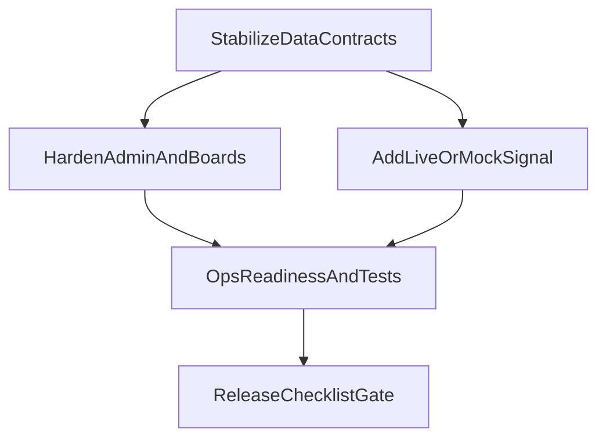

# 통합 현황 기반 개발 로드맵

## 현재 개발 현황 판단

### 이미 잘 구현된 영역
- **관리자 기본 포털 구조**: [src/app/admin/page.tsx](c:/Users/ja010/Desktop/hwaran/src/app/admin/page.tsx), [src/components/admin/AdminSidebar.tsx](c:/Users/ja010/Desktop/hwaran/src/components/admin/AdminSidebar.tsx)
- **커뮤니티 확장 경로(API 포함)**: [src/app/api/boards/route.ts](c:/Users/ja010/Desktop/hwaran/src/app/api/boards/route.ts), [src/app/api/boards/[id]/route.ts](c:/Users/ja010/Desktop/hwaran/src/app/api/boards/[id]/route.ts), [src/app/api/boards/[id]/comments/route.ts](c:/Users/ja010/Desktop/hwaran/src/app/api/boards/[id]/comments/route.ts)
- **관리자 모더레이션 엔드포인트**: [src/app/api/admin/boards/[id]/moderation/route.ts](c:/Users/ja010/Desktop/hwaran/src/app/api/admin/boards/[id]/moderation/route.ts)
- **Notion 연동 기반 DB 스키마 준비**: [scripts/setup-notion-dbs.ts](c:/Users/ja010/Desktop/hwaran/scripts/setup-notion-dbs.ts), [src/lib/notion.ts](c:/Users/ja010/Desktop/hwaran/src/lib/notion.ts)

### 부분 완료/갭이 큰 영역
- **상세 페이지 데이터 일관성**
  - 공지/동아리 상세가 실데이터 대신 mock 의존 가능: [src/app/notices/[id]/page.tsx](c:/Users/ja010/Desktop/hwaran/src/app/notices/[id]/page.tsx), [src/app/clubs/[id]/page.tsx](c:/Users/ja010/Desktop/hwaran/src/app/clubs/[id]/page.tsx)
- **관리자 상세 API 스키마 일관성**
  - mock과 Notion 응답 형태 차이 위험: [src/app/api/admin/drafts/[id]/route.ts](c:/Users/ja010/Desktop/hwaran/src/app/api/admin/drafts/[id]/route.ts), [src/app/api/admin/applications/[id]/route.ts](c:/Users/ja010/Desktop/hwaran/src/app/api/admin/applications/[id]/route.ts)
- **알림 UX 완성도**
  - Notion 경로에서 전체 읽음/대량 처리 미흡: [src/app/api/admin/notifications/route.ts](c:/Users/ja010/Desktop/hwaran/src/app/api/admin/notifications/route.ts)
- **운영 가시성 부족**
  - 현재 mock fallback인지 실DB인지 사용자/운영자가 즉시 알기 어려움: [src/lib/data.ts](c:/Users/ja010/Desktop/hwaran/src/lib/data.ts)

### 운영 전 리스크(우선순위)
1. 관리자 상세 API의 실환경 응답 구조 불일치
2. 상세 페이지의 mock 고정/혼용으로 데이터 신뢰도 저하
3. 알림 흐름(특히 전체 읽음)의 Notion 경로 미완성
4. env 미설정 시 조용한 fallback으로 장애 탐지 지연
5. 권한 정책(미들웨어/API) 경계가 기능별로 완전히 정규화되지 않음

## 앞으로 추가 구현해야 할 기능 (우선순위)

## Phase 1: 발표/운영 안정화 (즉시)
- **데이터 일관화**
  - 상세 페이지를 전부 `lib/data` 또는 API 기반으로 통일
- **관리자 API 계약 통일**
  - drafts/applications 상세 GET을 프론트 기대 스키마로 정규화
- **알림 기능 보강**
  - Notion 모드에서 `all` 읽음 처리 및 처리 결과 일관 응답
- **운영 상태 표시**
  - 상단 또는 관리자 영역에 `MOCK/NOTION LIVE` 상태 배지 추가

## Phase 2: 커뮤니티/관리자 실사용 완성
- **게시판 작성/수정/삭제 권한 하드닝**
  - 작성자 본인 + 관리자 override 정책을 전 엔드포인트에 동일 적용
- **모더레이션 로그/사유 기록**
  - 승인/반려/해결/대기 전환 시 사유 기록 및 조회 가능화
- **첨부파일 흐름 고도화**
  - 업로드 실패/만료 URL/대체 경로에 대한 사용자 피드백 강화

## Phase 3: 운영 품질 및 확장
- **테스트 체계 도입**
  - Auth, Boards, Admin APIs 계약 테스트 + 핵심 E2E 시나리오
- **관측성/장애 대응**
  - 공통 에러 포맷, 요청 ID, 관리자 액션 감사 로그
- **문서 동기화**
  - README와 실제 구현 기능/제약사항/운영 방법 정합화

## 실행 흐름

## 2주 실행 계획
- **Week 1 (필수 안정화)**
  - 상세 페이지 mock 제거
  - 관리자 상세 API 스키마 정규화
  - 알림 전체 읽음 Notion 처리
  - mock/live 상태 표시
- **Week 2 (운영 품질)**
  - 권한/모더레이션 로그 강화
  - 핵심 API + E2E 테스트 추가
  - 문서/운영 체크리스트 정리

## 완료 기준 (Definition of Done)
- 공지/동아리/커뮤니티에서 mock-실데이터 혼용이 없어야 함
- 관리자 상세/알림 API가 mock/Notion 모두 동일한 응답 계약을 만족해야 함
- 발표 시나리오(회원가입→글작성→댓글→모더레이션→알림)가 단일 환경에서 재현 가능해야 함
- 빌드/린트/핵심 테스트가 모두 통과해야 함